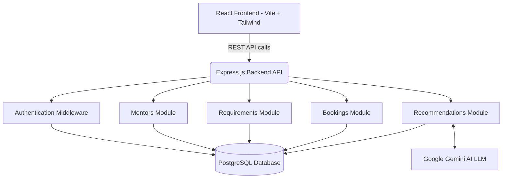

# Mentoring Call Scheduling System

A full-stack mentoring scheduling application designed to connect mentees with mentors through an intelligent, AI-powered matchmaking system and interactive calendar interface.

## System Architecture

The application follows a modern client-server architecture with a React frontend, Node.js backend, and PostgreSQL database.



## Directory Structure

```text
mentoring_call_scheduling_system/
├── backend/
│   ├── src/
│   │   ├── config/          # Database and environment configurations
│   │   ├── middleware/      # JWT authentication and RBAC
│   │   ├── modules/         # Domain-specific route controllers
│   │   │   ├── auth/        # Login and registration
│   │   │   ├── bookings/    # Session scheduling
│   │   │   ├── mentors/     # Mentor directory management
│   │   │   ├── recommendations/ # AI match generation
│   │   │   └── requirements/    # Mentee request processing
│   │   └── server.js        # Express application entry point
│   ├── .env                 # Backend environment variables
│   └── package.json         # Backend dependencies
│
└── frontend/
    ├── src/
    │   ├── components/
    │   │   ├── layout/      # Shared dashboard layouts
    │   │   └── ui/          # Reusable UI components (TimeGrid, TagPill, etc.)
    │   ├── lib/
    │   │   └── api/         # API client wrapper
    │   ├── pages/
    │   │   ├── admin/       # Administrator dashboards and tools
    │   │   ├── auth/        # Authentication interfaces
    │   │   ├── mentor/      # Mentor scheduling interface
    │   │   └── user/        # Mentee request interface
    │   ├── App.tsx          # Application routing
    │   ├── index.css        # Global styles and Tailwind configuration
    │   └── main.tsx         # React application entry point
    ├── .env                 # Frontend environment variables
    ├── index.html           # HTML template
    ├── package.json         # Frontend dependencies
    ├── tailwind.config.js   # Tailwind CSS theme configuration
    └── vite.config.ts       # Vite bundler configuration
```

## Features

- **Role-Based Access Control:** Distinct interfaces and permissions for Mentees, Mentors, and Administrators.
- **AI-Powered Matchmaking:** Leverages Google Gemini to rank mentors based on mentee requirements and generate natural language rationales for the pairing.
- **Interactive Scheduling:** Custom-built TimeGrid component for managing weekly availability and analyzing mutual overlaps.
- **Batch Processing:** Administrative tools to batch-process pending mentoring requests efficiently.
- **Enterprise UI:** High-fidelity, data-driven dashboards utilizing Tailwind CSS for a responsive, modern aesthetic.

## Local Development Setup

1. Install dependencies for both environments:
   - Navigate to `/backend` and run `npm install`
   - Navigate to `/frontend` and run `npm install`

2. Configure environment variables:
   - In `/backend`, ensure `.env` contains your PostgreSQL credentials, JWT secret, and LLM API Key.
   - In `/frontend`, ensure `.env` sets `VITE_API_URL=http://localhost:5000/api`.

3. Start the development servers:
   - Backend: Run `npm run dev` in the `/backend` directory.
   - Frontend: Run `npm run dev` in the `/frontend` directory.
