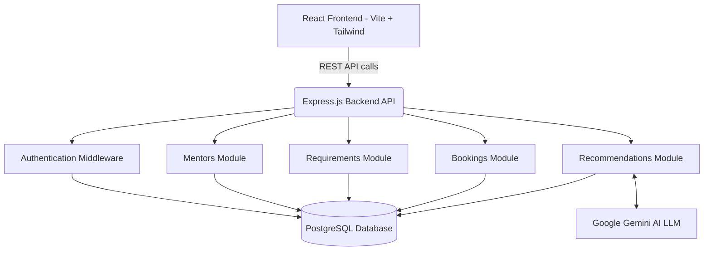
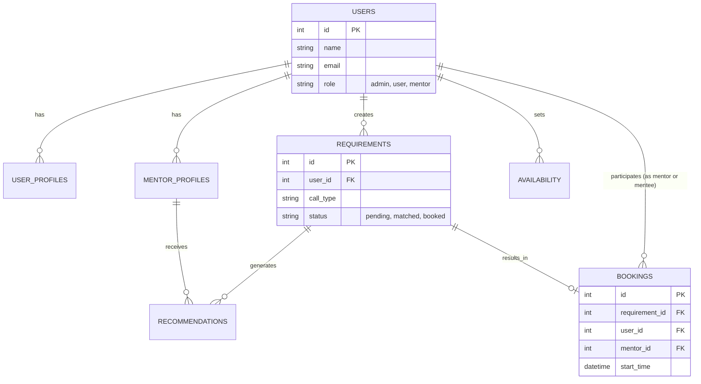
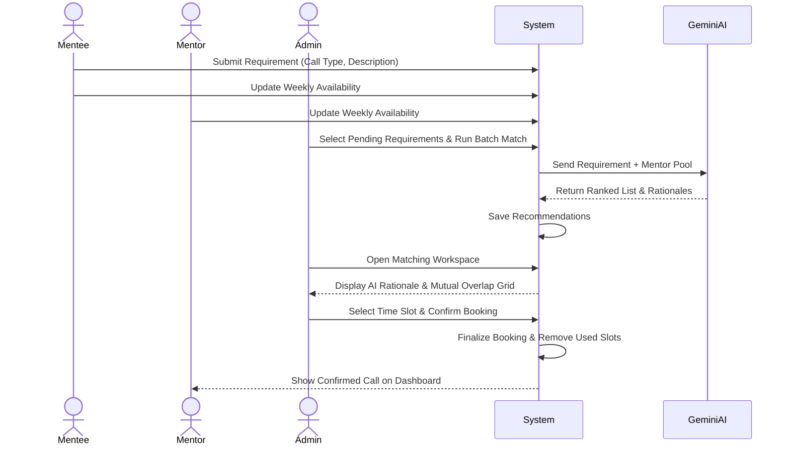

# Mentoring Call Scheduling System

A full-stack mentoring scheduling application designed to seamlessly connect mentees with mentors through an intelligent, AI-powered matchmaking system and an interactive, real-time calendar interface.

## Table of Contents
- [Overview](#overview)
- [System Architecture](#system-architecture)
- [Key Features](#key-features)
- [Technology Stack](#technology-stack)
- [Database Schema](#database-schema)
- [Directory Structure](#directory-structure)
- [Local Setup & Installation](#local-setup--installation)
- [Usage Guide](#usage-guide)

## Overview

The Mentoring Call Scheduling System is built to solve the complexities of matching junior talent with senior industry experts. Instead of relying on manual sorting, the system utilizes Google Gemini AI to analyze mentee requirements and automatically rank the best available mentors in the network. The platform offers a bespoke interactive TimeGrid for managing complex availability schedules across different timezones, ensuring that bookings are mathematically precise and conflict-free.

## System Architecture

The application follows a modern client-server architecture. The frontend is a single-page React application, communicating via RESTful JSON APIs to an Express.js Node backend, which interfaces directly with a PostgreSQL relational database.



## Key Features

- **Role-Based Access Control (RBAC):** Distinct interfaces, dashboards, and API permissions for Mentees, Mentors, and Administrators.
- **AI-Powered Matchmaking:** Leverages Google Gemini to rank mentors based on a mentee's specific requirements (e.g., Resume Revamp, System Architecture) and generates natural language rationales explaining why a mentor is a strong fit.
- **Interactive Scheduling Grid:** A custom-built, React-based TimeGrid component for visualizing weekly availability, supporting drag-to-select functionality, and analyzing mutual overlaps between parties.
- **Batch Processing Workspace:** Administrative tools allowing platform operators to select multiple pending requests and execute batch-matching algorithms to optimize calendar placement.
- **Real-Time Data Flow:** All dashboards are perfectly wired to the PostgreSQL database, providing optimistic UI updates and live data rendering for confirmed calls, matching efficiency, and mentor statuses.
- **Enterprise Design System:** High-fidelity, data-driven dashboards utilizing Tailwind CSS to achieve a responsive, modern aesthetic mirroring top-tier SaaS platforms.

## Technology Stack

**Frontend:**
- React 18
- TypeScript
- Vite (Build Tool)
- Tailwind CSS (Styling & Design System)
- React Router DOM (Routing)
- Lucide React (Iconography)

**Backend:**
- Node.js
- Express.js
- PostgreSQL (Primary Database)
- `pg` (Node Postgres Client)
- JSON Web Tokens (JWT Authentication)
- bcryptjs (Password Hashing)
- Google Generative AI SDK (LLM Integration)

## Database Schema

The core relational models driving the platform include:
- `users`: Core identity management (ID, Name, Email, Role, Hashed Password).
- `user_profiles`: Mentee-specific metadata and preferred tags.
- `mentor_profiles`: Mentor-specific metadata including active status, dynamic quotes, system tags, and AI evaluation metrics (`ai_rationale`, `network_health`).
- `requirements`: Mentee requests detailing the call type, textual description, and current matching status (`pending`, `matched`, `booked`).
- `availability`: Time slot allocations mapped by day of the week and hour for both mentors and mentees.
- `bookings`: Finalized, confirmed sessions mapping a mentee, mentor, and specific datetime range.
- `recommendations`: Cached AI scoring outputs mapping requirements to potential mentors.



## Directory Structure

```text
mentoring_call_scheduling_system/
├── backend/
│   ├── src/
│   │   ├── config/          # Database connection strings and env mapping
│   │   ├── middleware/      # JWT authentication and Role-Based Access Control
│   │   ├── modules/         # Domain-specific route controllers
│   │   │   ├── auth/        # Login, registration, and session management
│   │   │   ├── bookings/    # Session scheduling and calendar overlap
│   │   │   ├── mentors/     # Mentor directory and profile management
│   │   │   ├── recommendations/ # Generative AI match generation logic
│   │   │   └── requirements/    # Mentee request processing and batching
│   │   └── server.js        # Express application entry point
│   ├── fixPasswords.js      # Utility script for hash migration
│   ├── testHash.js          # Utility script for verifying bcrypt outputs
│   ├── .env                 # Backend environment variables
│   └── package.json         # Backend dependencies
│
└── frontend/
    ├── src/
    │   ├── components/
    │   │   ├── layout/      # Shared dashboard layouts and sidebars
    │   │   └── ui/          # Reusable UI components (TimeGrid, TagPill, etc.)
    │   ├── lib/
    │   │   └── api/         # Isomorphic API client wrapper
    │   ├── pages/
    │   │   ├── admin/       # Administrator matching workspaces and queues
    │   │   ├── auth/        # Authentication interfaces (Login/Signup)
    │   │   ├── mentor/      # Mentor scheduling and confirmed calls interface
    │   │   └── user/        # Mentee request and availability interface
    │   ├── App.tsx          # Application routing definitions
    │   ├── index.css        # Global styles and Tailwind configuration
    │   └── main.tsx         # React application entry point
    ├── .env                 # Frontend environment variables
    ├── index.html           # HTML template
    ├── package.json         # Frontend dependencies
    ├── tailwind.config.js   # Tailwind CSS theme configuration
    └── vite.config.ts       # Vite bundler configuration
```

## Local Setup & Installation

Follow these steps to deploy the application locally for development or testing:

1. **Clone the Repository**
   Pull the code to your local machine.

2. **Install Dependencies**
   Open two terminal windows.
   - Terminal 1 (Backend): Navigate to `/backend` and run `npm install`
   - Terminal 2 (Frontend): Navigate to `/frontend` and run `npm install`

3. **Configure Environment Variables**
   - **Backend:** Ensure the `/backend/.env` file contains your PostgreSQL connection string (`DATABASE_URL`), your `JWT_SECRET`, and your `LLM_API_KEY` for Google Gemini.
   - **Frontend:** Ensure the `/frontend/.env` file sets `VITE_API_URL=http://localhost:5000/api`.

4. **Start the Development Servers**
   - **Backend:** Run `npm run dev` in the `/backend` directory. The server will launch on port 5000.
   - **Frontend:** Run `npm run dev` in the `/frontend` directory. The Vite server will launch and provide a localhost URL (typically port 5173).

## Usage Guide

- **Mentee Workflow:** Register as a User. Navigate to the dashboard, input your weekly availability on the TimeGrid, and submit a new Mentoring Requirement with custom skill tags.
- **Mentor Workflow:** Register as a Mentor. Update your recurring weekly availability. View your confirmed upcoming calls on the right-hand sidebar.
- **Administrator Workflow:** Log in as an Admin. View the Requirements Queue to see all pending mentee requests. Select multiple requests and run a Batch Match. Navigate to the Matching Workspace to review AI rationales, observe the visual calendar overlap between the Mentee and the Mentor, and finalize the booking.

### Core Booking Flow


